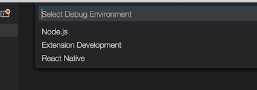

# React Native Tools Extension

This extension provides development environment for React Native projects. You can debug your code, quickly run `react-native` commands from command palette and use intellisense to browse objects, functions and parameters for React Native APIs.


Currently extension is only supported for `android` and `ios`.

## Getting started

* Install the extension in VS Code
* Please follow the steps outlined [here](https://facebook.github.io/react-native/docs/getting-started.html) to setup your environment for the target platform.
* Open your React Native project in VS Code.

### <a name="enableintellisense"></a>
### Enabing Intellisense
Due to some technical reasons, Intellisense is currently not supported out of the box. After opening your React Native project for the first time, you will see following prompt


Click **yes** to automatically configure your environment for enabling intellisense in your project. You will need to restart VS Code once for changes to take effect.

## Choose the React Native debug environment

Click the debug icon () in the View bar, and then click the configure gear icon () to choose the React Native debug environment.



VS Code will generate a `launch.json` in your project. It contains some default configurations such as what is shown below.


You can modify these configurations or add new ones to the list. You can use other fields in these configurations as well.

For example:

Name                               | Description                                                                                                  | Defaults
---------------------------------- | -------------------------------------------------------------------------------------------------------------| ---------
`target`                           | The 'simulator', 'device', or the name of the emulator to run on. `target` is not supported for android yet  | 'iPhone 5s' for ios


## Debug your React Native project

To start the debugger, choose a target from the target drop-down list, and then either click the start button () or press F5.


You can debug your app on an Android emulator/device, iOS simulator. Debugging on ios device is not yet supported.

We won't go into all of the great things that you can do with the Visual Studio Code debugger, but you can read about it [here](https://code.visualstudio.com/docs/editor/debugging).

> **Troubleshooting tip:**
If you receive an error stating that ADB is not recognized as an internal or external command, you'll have to update your path variable to include the location of your *ADB* executable.
The *ADB* executable file is located in a subdirectory along with your other Android SDK files.


### Debugging on ios device
Debugging on iOS device isn't straightforward and requires following manual steps:
* step1
* step2

## Using React Native commands in the Command Palette

In the Command Palette, type ```React Native``` and choose a command.


The **Run Android** command triggers ```react-native run-android``` and starts your app for android.

The **Run iOS** command similarly triggers ```react-native run-ios``` and starts your app for ios.

The **Packager** commands allow you to start/stop the [**React-packager**](https://github.com/facebook/react-native/tree/master/packager).

## Use IntelliSense

Intellisense helps you discover objects, functions, and parameters in React Native.


Once you have enabled intellisense by following [these](#enableintellisense) steps, you can start start typing in the code editor to see the objects, functions, and parameters of your React Native libraries and your own code.

## How to disable telemetry reporting

VS Code React Native extension collects usage data and sends it to Microsoft to help improve our products and services. Read our [privacy statement](https://www.visualstudio.com/en-us/dn948229) to learn more.

If you don’t wish to send usage data to Microsoft, please follow the instructions below to disable its collection.

Important Notice: You will need to apply these changes after every update to disable collection of usage data. These changes do not survive product updates.

### Windows

* Edit VSCodeTelemetrySettings.json file at %appdata%\vscode-cordova and add "optIn":false.

### OS X / Linux

* Edit VSCodeTelemetrySettings.json file at ~/.vscode-react-native and add "optIn":false.