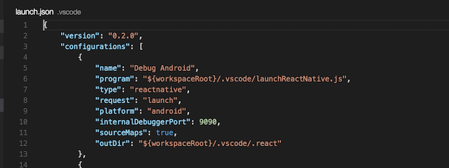

# Setting up debug environment

Once you have set up a `launch.json` file with default configurations, you can modify these configurations, or add new ones to the list. You can use other fields in these configurations as well.



For example, you can modify the `target` field to specify the simulator you want to target for iOS debugging.

## Debugging with TypeScript and Haul
If you use Haul instead of the react-native packager, you must add `sourceMapPathOverrides` to the `launch.json` file.

For example:
```
"sourceMapPathOverrides": {
    "webpack:///./~/*":   "${workspaceRoot}/node_modules/*",
    "webpack:///./*":   "${workspaceRoot}/*",
    "webpack:///*":     "*"
}
```
See more about source map overrides [here](https://github.com/Microsoft/vscode-node-debug2#sourcemappathoverrides)

## Debugging on iOS device
Debugging on an iOS device require following manual steps:
* Install [ios-deploy](https://www.npmjs.com/package/ios-deploy) `npm install -g ios-deploy`.
* Have a valid iOS Development certificate installed.
* In your project's `launch.json` file set `target` to `device` or use 'launchArguments' property to specify particular device to run on in case of multiple devices connected, e.g. `"arguments": [ "--device", "My iPhone" ]`
* Choose **Debug iOS** configuration from the Configuration dropdown and press F5.
* Shake the device to open the development menu and select "Debug JS Remotely".